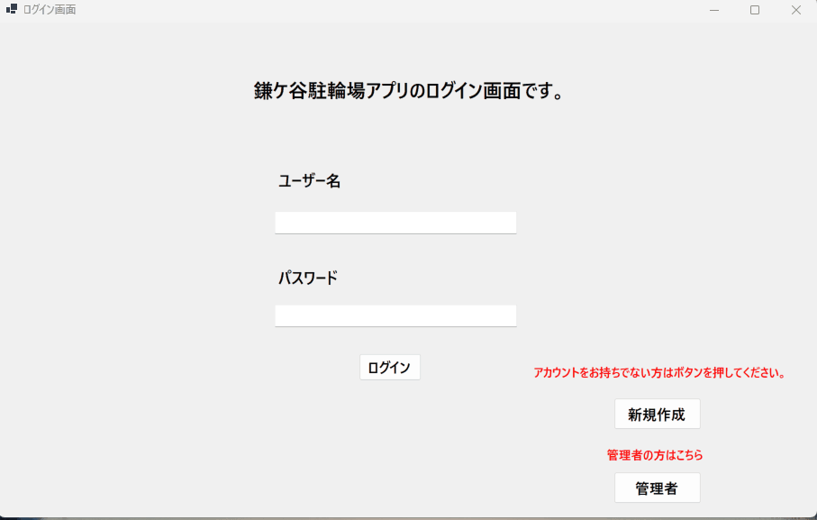

# CycleNumberManageTool

## 概要
地元の駐輪場における駐輪番号と利用時間を管理する
**C#（Windows Forms）製のデスクトップアプリケーション**です。

ユーザーの出勤・退勤操作に応じて、
駐輪番号の登録・駐輪料金の計算・DBへの保存を行います。

---

## 作成背景・目的
本アプリケーションは、**日常で感じていた不便さの解消**と、  
**実務で使用している技術スタックの理解を深めること**を目的として作成しました。

私は通勤時に月極ではない駐輪場を利用しており、  
駐輪番号を忘れると精算時に自転車の場所まで戻る必要がある点に不便さを感じていました。  
そのため、日付・駐輪番号・入出庫時刻をスマートフォンに手動でメモしていましたが、  
メモし忘れることもあり、**記憶や手入力に依存しない管理方法が必要だと考えました。**

また、業務において **C# と SQL Server（SSMS）** が使用される案件が多く、  
案件参画時に業務を円滑に進められるよう事前学習を目的として本アプリを作成しました。  
加えて、現場でデスクトップアプリ（VB.NET）を扱う機会もあることから、  
同様の業務形態を想定し、**C#（Windows Forms）によるデスクトップアプリ**として実装しています。

本アプリは、**実務で使用されている技術を用いて身近な課題を業務システムとして形にする**  
ことを意識し、設計・実装・DB連携まで一通り行ったポートフォリオです。

---

## アプリケーションデモ

### ログイン〜出勤・退勤処理
ログイン後、駐輪番号の登録および出勤・退勤処理を行う一連の流れです。

---

### ユーザー管理（CRUD）
ユーザーの更新・削除を行う管理機能です。

---

## 機能一覧
- ユーザー登録・更新・削除
- 駐輪番号の登録・変更
- 出勤／退勤処理
- 駐輪時間に応じた料金計算（14時間ごとに100円加算）
- SQL Server へのデータ保存
- DataGridView を用いた一覧表示・更新チェック

---

## 使用技術
- C# (.NET 8 / Windows)
- Windows Forms
- SQL Server
- ADO.NET
- Visual Studio 2022
- GitHub Actions（push 時に自動ビルド）

---

## 工夫した点
- DBアクセス処理を共通クラスにまとめ、重複コードを削減
- SQLインジェクション対策としてパラメータ付きSQLを使用
- DataGridView の視認性向上（更新・削除行の色分け）
- 処理フローを意識した画面遷移設計

---

## 今後の改善点
- ユーザーごとの月別駐輪金額を集計し、Excel形式で出力する帳票機能の追加
- 複数のDB更新処理を安全に実行するため、トランザクション制御の仕組みを理解した上での導入
- 障害発生時の原因特定を容易にするため、ログ出力機能の追加
- try-catch が分散している箇所を整理し、例外処理方針を統一する

